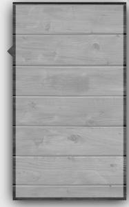

# TexturedPopoverBackgroundView

Variant of TexturedPopoverBackgroundView UIPopoverBackgroundView which supports textured background, rouned corners, etc.



## Installation

### Cocoapods

```ruby
pod 'TexturedPopoverBackgroundView`
```

## Usage

```swift
import UIKit
import TexturedPopoverBackgroundView

class ViewController: UIViewController {

    func customize() {
        TexturedPopoverBackgroundView.setBorderColor(.green)
        TexturedPopoverBackgroundView.setBorderWidth(1)
        TexturedPopoverBackgroundView.setBackgroundImageGetter { UIImage(named: "popover-bg")! }
	 }
	
    override func viewDidLoad() {
        super.viewDidLoad()
        customize()
    }
    
	func showMyControllerAsPopover() {
		
        let rect: CGRect = .zero

        let vc = UIViewController()
        vc.view.backgroundColor = UIColor(white: 1, alpha: 0.5)
        vc.modalPresentationStyle = .popover
        
        let popoverController = vc.popoverPresentationController!
        
        popoverController.sourceRect = rect
        popoverController.sourceView = view
        
        popoverController.popoverBackgroundViewClass = TexturedPopoverBackgroundView.self
        
        present(vc, animated: true, completion: nil)
    }

}
```

## Customization

* borderWidth
* borderColor
* cornerRadius
* backgroundImageGetter
* arrowBase
* arrowHeight

**NOTE**: Customization works only for concrete class - if you use inheritance then your class will store properties only for its own use. So you should customize all classes you created:

```swift
class MyClass1: TexturedPopoverBackgroundView {}
class MyClass2: TexturedPopoverBackgroundView {}
class MyClass3: TexturedPopoverBackgroundView {}

func customize() {
   let value: CGFloat = 10
	TexturedPopoverBackgroundView.setCornerRadius(value)
	MyClass1.setCornerRadius(value)
	MyClass2.setCornerRadius(value)
	MyClass3.setCornerRadius(value)		
}
```

## Authors
* Siarhei Ladzeika <sergey.ladeiko@gmail.com>

## LICENSE
This project is licensed under the MIT License - see the [LICENSE](LICENSE) file for details
